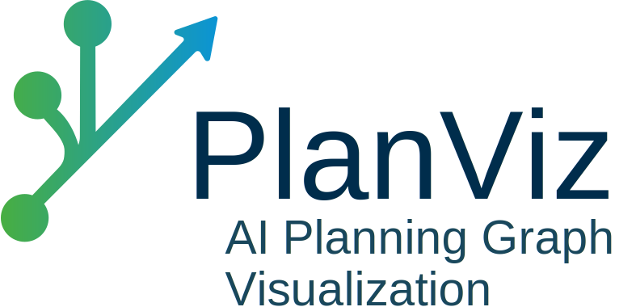

<div align="center">
  
</div>

# PlanViz

A web-based visualization tool for PDDL (Planning Domain Definition Language) files, built with Vue.js frontend and FastAPI backend using Fast Downward planner.

## Features

- **PDDL File Upload**: Upload domain and problem files
- **Graph Visualizations**:
  - Causal Graph - Shows variable dependencies and strongly connected components (SCCs)
  - Landmark Graph - Displays planning landmarks with different edge types
  - Domain Transition Graph - Interactive state transitions for variables
- **Interactive Interface**: Click, highlight, and explore graph elements
- **Dark/Light Mode**: Responsive design with theme switching. Based on your browser settings.
- **Docker Support**: Containerized deployment for easy setup

## Architecture

- **Frontend**: Vue.js 3 with Vite, Cytoscape.js for graph rendering, Tailwind CSS
- **Backend**: FastAPI with modified Fast Downward integration for PDDL processing
- **Deployment**: Docker Compose with multi-stage builds

## System Requirements

- **Docker**: 4GB+ RAM recommended for large PDDL files
- **Local**: 
  - **Python**: 3.11+ 
  - **Node.js**: 20+ 
  - **npm**: 9+ (usually comes with Node.js)
  - **Fast Downward dependencies**
    - **CMake**: 3.16+
    - **C++20 compatible compiler**: (GCC 10+ or Clang 10+)
    - **Build essentials**: (make, git)

## Quick Start

### Using Docker (Recommended)

1. Clone the repository:
```bash
git clone git@github.com:EliaPfl/planviz.git
cd planviz
```

2. Start with Docker Compose:
```bash
docker-compose up --build
```

3. Access the application:
   - Web interface: http://localhost:8080
   - Backend API accessible through nginx proxy only

### Local Development (Unix)

1. Make scripts executable and build:
```bash
chmod +x build.sh run.sh
./build.sh
```

2. Start development servers:
```bash
./run.sh
```
3. Access the application:
    - Web interface: http://localhost:3000
    - Backend: http://localhost:8000

## Usage

1. **Upload PDDL Files**: Navigate to the upload page and select your domain and problem files
2. **View Graphs**: Choose from available graph types in the navigation
3. **Interact**: Click nodes/edges to see details, double-click nodes to open Domain Transition Graph
4. **Explore**: Use the sidebar to browse all graph elements

## Graph Types

### Causal Graph
- Shows causal dependencies between planning variables
- Color-coded strongly connected components (SCCs)
- Distinguishes goal variables with special shapes

### Landmark Graph
- Displays planning landmarks and their relationships
- Different edge styles for landmark types:
  - Dotted: Natural ordering
  - Dashed: Necessary ordering
  - Solid: Greedy necessary/reasonable ordering

### Domain Transition Graph
- Interactive state transition visualization for individual variables
- Shows possible value transitions and conditions


## Development


### Fast Downward Modifications
This project extends Fast Downward with custom graph extraction capabilities for web visualization:

- **Graph-only search**: Custom algorithm that generates planning graphs without solving
- **JSON export**: All graph classes enhanced with JSON serialization using [nlohmann/json](https://github.com/nlohmann/json)

See the [File Structure](#file-structure) section below for details on modified components.

### File Structure

```
planviz/
├── backend/                    # FastAPI backend
│   ├── main.py                 # Main API endpoints and PDDL processing
│   ├── requirements.txt        # Python dependencies
│   ├── Dockerfile              # Backend container configuration
│   └── out_graphs/             # Generated graph JSON files
├── frontend/                   # Vue.js frontend
│   ├── src/                    # Vue components and application logic
│   │   ├── components/         # Reusable UI components
│   │   ├── views/              # Page components
│   │   └── utils/              # Helper functions
│   ├── Dockerfile              # Frontend container configuration
│   ├── nginx.conf              # Nginx reverse proxy configuration
│   └── package.json            # Node.js dependencies
├── downward/                   # Modified Fast Downward planner
│   └── src/search/             # Core search components (modified)
│       ├── heuristics/
│       │   ├── domain_transition_graph.h/.cc  # DTG with JSON export
│       ├── landmarks/
│       │   ├── landmark_graph.h/.cc           # Landmark graph with JSON export
│       ├── search_algorithms/
│       │   ├── graph_only_search.h/.cc        # Custom graph-only search
│       ├── task_utils/
│       │   ├── causal_graph.h/.cc             # Causal graph with JSON export
│       └── utils/
│           └── json.hpp                       # nlohmann JSON library
├── docker-compose.yml          # Multi-container orchestration
├── build.sh                    # Development build script
└── run.sh                      # Development run script
```

## Contributors

<table>
  <tbody>
    <tr>
      <td align="center" valign="top" width="14.28%">
        <a href="https://github.com/EliaPfl">
          
          <br />
          <sub><b>Elia</b></sub>
        </a>
      </td>
      <td align="center" valign="top" width="14.28%">
        <a href="https://github.com/IsinGelan">
          
          <br />
          <sub><b>Florian</b></sub>
        </a>
      </td>
      <td align="center" valign="top" width="14.28%">
        <a href="https://github.com/PN-1000">
          
          <br />
          <sub><b>Paul</b></sub>
        </a>
      </td>
    </tr>
  </tbody>
</table>
